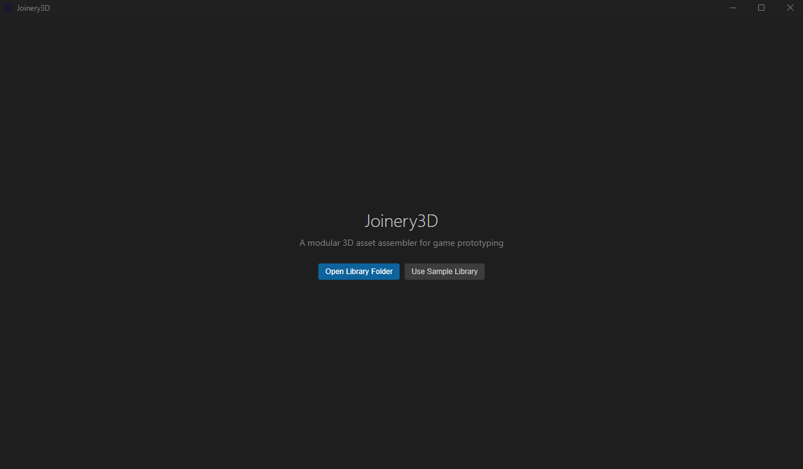
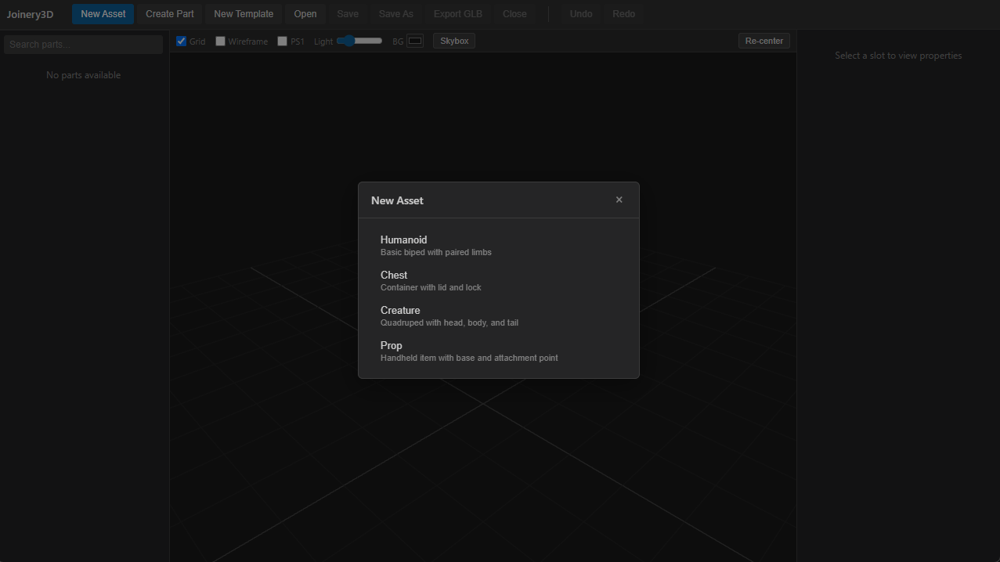
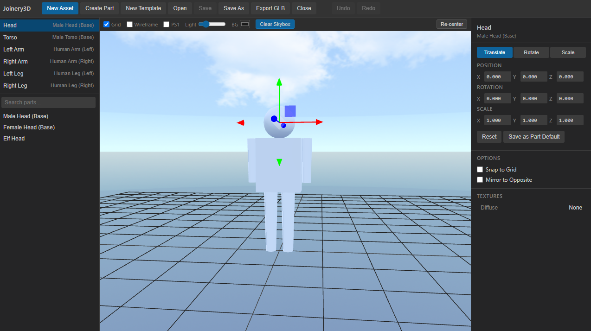
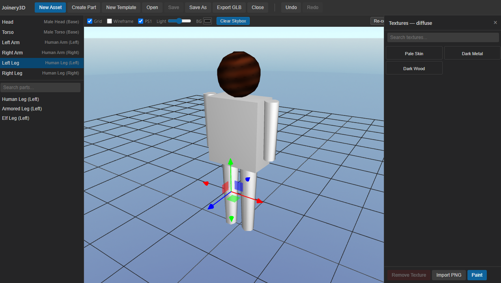

# Joinery3D

A modular 3D asset assembler for game prototyping. Compose characters, creatures, props, and environment pieces from a library of swappable parts, adjust alignment, swap textures, and export GLB assets ready for any modern engine.

Runs as a web app in any modern browser and as a native desktop app via Tauri on Windows, Mac, and Linux — from one codebase.

<p align="center">
  
</p>

<p align="center">
  
  
  
</p>

## Quickstart

### Web (browser)

```bash
pnpm install
pnpm dev
```

Open `http://localhost:1420`. Click **Use Sample Library** on the welcome screen.

### Desktop (Tauri)

```bash
pnpm install
pnpm tauri dev
```

Requires [Rust](https://rustup.rs/) and platform-specific dependencies. See the [Tauri prerequisites](https://v2.tauri.app/start/prerequisites/).

## Building an asset

1. **Open a library** — Click "Open Library Folder" to point at a folder with templates, parts, and textures. Or click "Use Sample Library" to start with the bundled example.

2. **Create a new asset** — Click "New Asset" in the topbar. Pick a template (e.g. Humanoid, Chest). The tool loads default parts into each slot and renders the assembled asset.

3. **Select a slot** — Click a part in the 3D viewport or click a slot name in the left sidebar. The selected slot highlights in the viewport.

4. **Swap a part** — With a slot selected, the library panel on the left filters to compatible parts. Click a part to swap it in. The change is immediate.

5. **Adjust alignment** — With a slot selected, the right sidebar shows transform controls. Use the gizmo in the viewport to drag, or type numeric values for position, rotation, and scale. Toggle between Translate/Rotate/Scale modes.

6. **Swap a texture** — Click a texture channel in the properties panel to open the texture drawer. Browse or search textures, click to assign. Import new PNGs by clicking "Import PNG".

7. **Paint a texture** — In the texture drawer, click "Edit" to open the pixel painter. Brush, eraser, fill bucket, color picker, and brush size. UV overlay shows where paint maps on the model. The viewport updates live as you paint. Save creates a new texture in the library.

8. **Save the project** — Click "Save" or "Save As" in the topbar. The project is a JSON file referencing the library by relative path.

9. **Export GLB** — Click "Export GLB" in the topbar. The assembled asset exports as a single GLB file that loads in Blender, Unity, Unreal, Godot, three.js, Babylon.js, or any GLB-compatible tool.

## Keyboard shortcuts

| Shortcut | Action |
|---|---|
| Ctrl+Z | Undo |
| Ctrl+Y / Ctrl+Shift+Z | Redo |

## Library structure

A library is a folder on disk:

```
my-library/
  templates/
    humanoid.template.json
    chest.template.json
  parts/
    head/
      head_male_base.glb
      head_male_base.json
    torso/
      torso_male_base.glb
      torso_male_base.json
  textures/
    skin_pale.png
    skin_pale.json
```

### Templates

A template defines the structure of an asset type — its slots, their anchors (position/rotation/scale in template space), default parts, and optional paired slots for mirroring.

```json
{
  "id": "humanoid",
  "name": "Humanoid",
  "description": "Basic biped with paired limbs",
  "version": 1,
  "slots": [
    {
      "tag": "head",
      "name": "Head",
      "anchor": { "position": [0, 1.6, 0], "rotation": [0, 0, 0], "scale": 1 },
      "defaultPartId": "head_male_base",
      "pairedSlot": null,
      "required": true
    }
  ]
}
```

### Parts

Each part is a GLB mesh file with a JSON sidecar describing its metadata:

```json
{
  "id": "head_male_base",
  "name": "Male Head (Base)",
  "tags": ["head"],
  "meshFile": "parts/head/head_male_base.glb",
  "defaultOffset": { "position": [0, 0, 0], "rotation": [0, 0, 0], "scale": 1 },
  "textureSlots": [
    { "channel": "diffuse", "defaultTextureId": "skin_pale", "variants": [] }
  ],
  "thumbnailFile": null
}
```

- **tags** — which template slots this part can fill
- **defaultOffset** — applied on top of the slot anchor whenever this part is used
- **textureSlots** — declares which texture channels the part uses, with optional named variants

### Textures

```json
{
  "id": "skin_pale",
  "name": "Pale Skin",
  "file": "textures/skin_pale.png",
  "width": 128,
  "height": 128,
  "tags": ["skin", "human"]
}
```

### Project files

A saved project is a JSON file referencing a template and recording which part fills each slot, per-slot transform overrides, and texture assignments:

```json
{
  "id": "elf_warrior_v1",
  "name": "Elf Warrior",
  "templateId": "humanoid",
  "version": 1,
  "slots": {
    "head": {
      "partId": "head_elf",
      "offset": { "position": [0, 0.02, 0], "rotation": [0, 0, 0], "scale": 1 },
      "textures": { "diffuse": "head_elf_pale" }
    }
  }
}
```

## Features

### Alignment tools

- **Mirror** — Toggle in the properties panel. When enabled, adjustments to a paired slot (e.g. left arm) automatically apply the X-mirrored transform to the opposite slot (right arm).
- **Snap to grid** — Toggle in the properties panel. Constrains position, rotation, and scale values to configurable increments (default: 0.05 translation, 5° rotation, 0.1 scale).
- **Save as part default** — Promotes the current per-instance offset into the part's library metadata, so every future use of that part starts from the corrected position.

### PS1 fidelity mode

Toggle in the viewport to render with PS1-era visual effects:

- Affine texture mapping (no perspective correction)
- Vertex snapping to configurable screen resolution (default 320×240)
- Low-resolution render target with point-filtered upscale
- Vertex color baking for the no-texture PS1 look
- Indexed-color (256-color) PNG export option

### Template authoring

Create new templates without editing JSON. Load a base GLB, map each mesh to a named slot with a tag and anchor point, and save.

### Texture painting

Built-in 2D pixel painter with brush, eraser, color picker, fill bucket, and per-canvas undo/redo. UV wireframe overlay shows how the 2D canvas maps to the 3D model. The viewport updates live as you paint.

## Tech stack

- **Preact** — UI framework (~3KB gzipped)
- **Zustand** — global state management
- **three.js** — 3D viewport (imperative, no React Three Fiber)
- **TypeScript** — strict mode, all flags enabled
- **Vite** — dev server and build
- **Tauri 2** — desktop packaging
- **Rust** — backend file I/O, schema validation, `ts-rs` for type sync
- **Vitest** — unit and integration tests

## Development

```bash
pnpm install          # Install dependencies
pnpm dev              # Start Vite dev server
pnpm tauri dev        # Start desktop app with hot reload
pnpm build            # Production web build
pnpm test             # Run tests
pnpm lint             # ESLint
pnpm tsc --noEmit     # Type check
pnpm generate:schema  # Regenerate TypeScript types from Rust
```

### Rust

```bash
cd src-tauri
cargo clippy --all-targets --all-features -- -D warnings
cargo fmt --check
cargo test
```

## License

MIT
